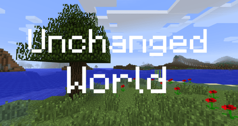

  

- **Default 1.6.4** generates the world exactly as Minecraft 1.6.4 did.
- **Integrated 1.6.4** customizable world gen in which you can mix 1.6.4 and 1.7 world gen.

## Requirements
- [UniMixins](https://www.curseforge.com/minecraft/mc-mods/unimixins)

## How to use

**World Type** in the world creation menu has two new options: *Default 1.6.4* and *Integrated 1.6.4*.

On a server, set `level-type=default_1_6_4` or `level-type=integrated_1_6_4` in `server.properties` before the world is created.

## Configuration

Integrated 1.6.4 is configured in `config/unchangedworld.cfg`. Changes only affect newly generated chunks.

- **Generator**: biome layout, terrain, caves, ravines, lighting, climate, surface rules, animal spawns, dungeons, mineshafts, stronghold biomes and chest books.
- **Biomes**: large biomes, modded biomes, and the weight of the 1.6.4 biomes against modded ones.
- **Surface**: gravel sea floors, deeper sandstone and stone patches on extreme hills.
- **Decoration**: each 1.7.10 plant feature on or off and the 1.6.4 jungle vines.
- **Trees**: 1.7.10 tree selection for forests, extreme hills, ice plains and jungles.

## Mod compatibility

- Compatible with Modded biomes.
- Compatible with Colored Lights (RPLE).
- Compatible with EndlessIDs.
- If you use Biomes O' Plenty, open config/biomesoplenty/biomegen.cfg and set every line under "vanilla biomes to override" to false, otherwise BoP replaces the vanilla biomes with its own versions. If you are okay with this, then just leave it.

